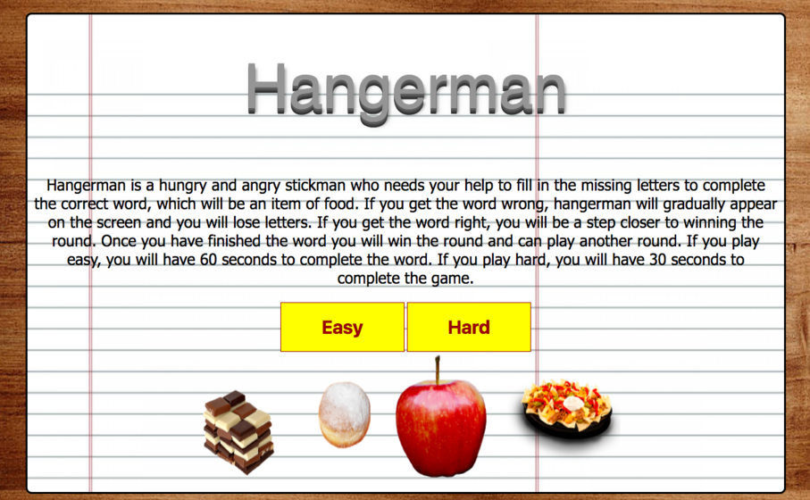

# Hangerman

## How To Play
* Players are required to select the correct letters to fill in the missing blanks of a hangman word, which is associated with a type of food.
* If the word is correctly guessed, the player wins a round and can then play another round.
* If the word is incorrectly guessed, the game is over, but they can replay another round.

## Functionality
The game is a simple application designed in Sublime Text with HTML, CSS and JavaScript, which utilises the JQuery library.

Here is a link to the game demo <a href="https://lukeh1993.github.io/project-one/">Hangerman</a>.

## Easy Mode
Players have 60 seconds to correctly guess the missing characters of a word.

## Hard Mode
Players have 30 seconds to correctly guess the missing characters of a word.

## Screenshots

This screenshot demonstrates the first page of the game.

This screenshot demonstrates the game in action, after the player has selected a mode to play.

This screenshot demonstrates when the player has won a round and guessed the word correctly.

This screenshot demonstrates when the player has lost a round and guessed the word incorrectly.
